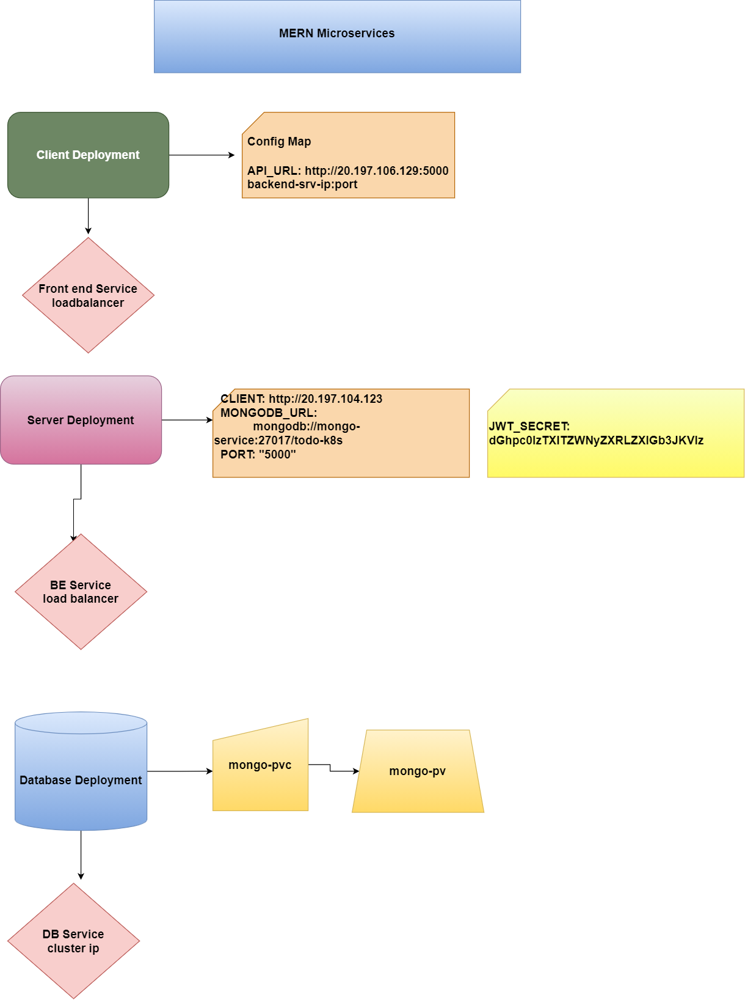

# React, Node Js, and MongoDB microservices-based application deployment on Kubernetes

This is a simple application build using MERN Stack. It consist of:
1. The Front-end application is build using React.
2. The backend is build using Node Js, Express, and mongoose.
3. The Database Layer will be using the NoSQL database i.e. MongoDB.
Notes: You can use kubectl port-forward mypod 27017:27017 and then just connect your mongodb client to localhost:27017.

